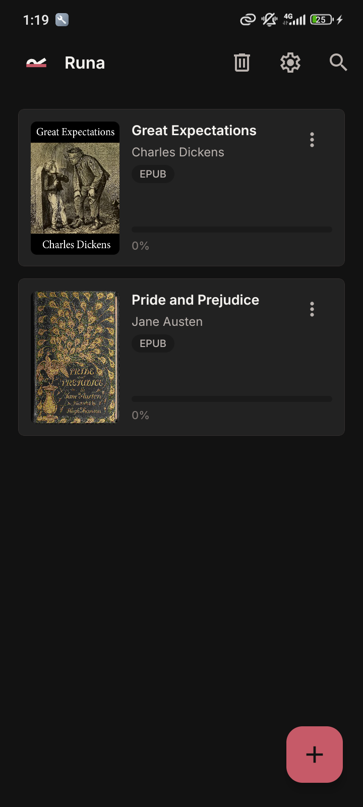

# Runa [](LICENSE)

A quiet, local-first Android reader for PDF, EPUB, and FB2 books.

## Motivation

Runa keeps a personal library on the device without requiring an account or a
cloud service. It can discover books in shared storage, remember reading
progress, and provide one consistent reading surface across common formats.

## Usage

Install the dependencies, then launch an Android development build:

```bash
pnpm install
pnpm android
```

The app includes manual and automatic library scanning, bookmarks, reading
progress, PDF password handling, day and night reading modes, and a recycle
bin for removed books.

## Preview

<p align="center">
  
</p>
